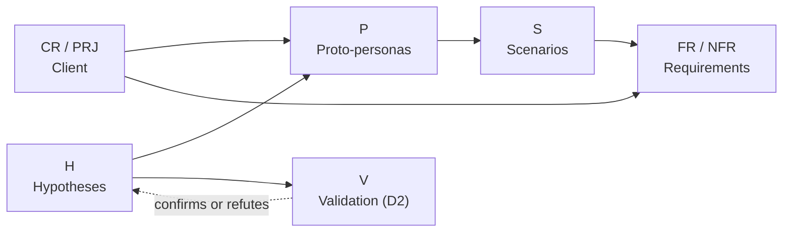

# Boutique FMAT — Offline Point of Sale and Inventory for Mobile Devices

> Project for the **Human-Computer Interaction** course (B.Sc. in Software Engineering, FMAT-UADY).
> **Delivery 1:** project definition, hypothesis-based user modeling and initial requirements.

| | |
|---|---|
| **Author** | Alancete (individual work) |
| **Client** | Course professor (Boutique FMAT-UADY) |
| **Current delivery** | 1 of 3 — due 2026-09-29 |
| **Branch** | [`first-delivery`](../../tree/first-delivery) |
| **Status** | In progress |
| **Design (Figma)** | _[paste link]_ |
| **Video / presentation** | _[paste link]_ |

---

## 1. What this project is

A point of sale (POS) and inventory system for the FMAT-UADY Boutique. It must:

- Run on **low-end mobile devices** `[PRJ-01]`.
- **Work offline** and synchronize later `[PRJ-02]`.
- Be simple enough for **a person with limited technology skills** `[PRJ-03]`.
- Manage inventory across **three warehouses** (CDU, Sociales, Matemáticas), with CDU as the main warehouse `[CR-08, CR-09]`.
- Serve **four user profiles** with different permissions (CDU, Central Administration, Social Sciences Campus, Exact Sciences Campus) `[CR-01…CR-04]`.
- Accept **cash, card and Interuady** payments, and send Interuady notes to **accounts receivable** `[CR-12…CR-14]`.

Full details, with identifiers, are in [`client/client-requirements.md`](client/client-requirements.md).

## 2. How to read this repository

Recommended order (follows the product process):

1. [Client requirements](client/client-requirements.md) — starting point and open questions.
2. [Project definition](docs/01-definition/project-definition.md) — social relevance, innovation, feasibility.
3. [User hypotheses](docs/02-research/hypotheses.md) — numbered assumptions behind the modeling.
4. [Proto-personas](docs/03-user-modeling/proto-personas.md) and [scenarios](docs/03-user-modeling/scenarios.md).
5. [Functional requirements](docs/04-requirements/functional-requirements.md), [non-functional requirements](docs/04-requirements/non-functional-requirements.md) and [traceability matrix](docs/04-requirements/traceability-matrix.md).
6. [Research and validation plan](docs/02-research/validation-plan.md) — what gets validated in delivery 2.
7. [Management](docs/00-management/): schedule, logbook, task log and contribution metrics.
8. [Presentation](docs/05-presentation/script.md).
9. [References](docs/references.md) — every external source used, with how to verify it.

## 3. Delivery 1 approach

**Decision:** **no user research was conducted** in this delivery. The work follows a **proto-persona (Lean UX)** approach: the author's assumptions are made explicit, users and requirements are modeled from them, and their validation is planned.

**Reason:** time constraints and individual work. Field research is scheduled for delivery 2 (see the [validation plan](docs/02-research/validation-plan.md)).

**Consequence:** no artifact in this delivery presents findings. Everything that does not come from the client is labeled as a hypothesis.

## 4. Evidence conventions

Every statement in this repository carries one of these labels:

| Label | Meaning | Where it lives |
|---|---|---|
| `CR-xx` | **Client requirement** — stated in the client's written document | `client/client-requirements.md` |
| `PRJ-xx` | **Project requirement** — part of the project brief given by the professor, not in the written document | `client/client-requirements.md` |
| `H-xx` | **Hypothesis** — unvalidated assumption | `docs/02-research/hypotheses.md` |
| `Q-xx` | **Open question** for the client | `client/client-requirements.md` |
| `V-xx` | Planned **validation activity** | `docs/02-research/validation-plan.md` |
| `[Rn]` | **External source**, checked against the original | `docs/references.md` |

Rule: **nothing is presented as a finding** until a `V-xx` activity confirms it; the hypothesis then changes status to *validated* or *refuted* and the evidence is recorded.

## 5. Identifiers and traceability

| Prefix | Artifact |
|---|---|
| `P-xx` | Proto-persona |
| `S-xx` | Scenario |
| `FR-xx` | Functional requirement |
| `NFR-xx` | Non-functional requirement (usability or quality attribute) |
| `T-xx` | Task (GitHub issue) |

Traceability rule: **every `P`, `S`, `FR` and `NFR` cites at least one `H`, `CR` or `PRJ`.** The full matrix is in [`traceability-matrix.md`](docs/04-requirements/traceability-matrix.md).



## 6. Repository structure

```
boutique-fmat-pos/
├── README.md
├── .github/
│   └── ISSUE_TEMPLATE/
│       └── task.md                          # template for every task (T-xx)
├── client/
│   ├── client-requirements.md               # CR-xx, PRJ-xx and open questions Q-xx
│   ├── rubric-delivery-1.md
│   └── originals/                           # documents exactly as delivered by the client
├── docs/
│   ├── 00-management/
│   │   ├── schedule.md
│   │   ├── task-log.md                      # tasks, owner, estimated and actual hours
│   │   ├── contribution-metrics.md          # objective individual contribution metric
│   │   └── logbook/                         # one entry per work session: YYYY-MM-DD.md
│   ├── 01-definition/
│   │   └── project-definition.md
│   ├── 02-research/
│   │   ├── hypotheses.md
│   │   ├── validation-plan.md
│   │   ├── instruments/                     # interview guides, surveys, test tasks
│   │   └── results/                         # empty in D1; filled in D2
│   ├── 03-user-modeling/
│   │   ├── proto-personas.md
│   │   ├── scenarios.md
│   │   └── img/
│   ├── 04-requirements/
│   │   ├── functional-requirements.md
│   │   ├── non-functional-requirements.md
│   │   └── traceability-matrix.md
│   ├── 05-presentation/
│   │   └── script.md                        # + slides (PDF) and video link
│   └── references.md                        # external sources [Rn], verified
├── design/
│   └── README.md                            # links to Figma, sketches and wireframes
└── src/
    └── README.md                            # reserved for later deliveries
```

## 7. Delivery 1 deliverables

| # | Artifact | File | Rubric criterion | Status |
|---|---|---|---|---|
| 1 | Client requirements and open questions | `client/client-requirements.md` | 1, 4 | Done |
| 2 | Project definition | `docs/01-definition/project-definition.md` | 1 | Done |
| 3 | User hypotheses | `docs/02-research/hypotheses.md` | 2 | Done |
| 4 | Proto-personas (primary and secondary) | `docs/03-user-modeling/proto-personas.md` | 2 | Done |
| 5 | Scenarios | `docs/03-user-modeling/scenarios.md` | 2 | Done |
| 6 | Functional requirements | `docs/04-requirements/functional-requirements.md` | 4 | Done |
| 7 | Non-functional requirements | `docs/04-requirements/non-functional-requirements.md` | 4 | Done |
| 8 | Traceability matrix | `docs/04-requirements/traceability-matrix.md` | 2, 4 | Done |
| 9 | Research and validation plan | `docs/02-research/validation-plan.md` | 2 | Done |
| 10 | Schedule | `docs/00-management/schedule.md` | 3 | Pending |
| 11 | Logbook and task log | `docs/00-management/` | 3, 6 | In progress |
| 12 | Individual contribution metrics | `docs/00-management/contribution-metrics.md` | 6 | Pending |
| 13 | Presentation script and slides | `docs/05-presentation/` | 5 | Pending |

## 8. Workflow and contribution evidence

Although this is an individual project, the process leaves verifiable evidence in the repository:

- **Branches:** `main` holds the approved version of each delivery. Each delivery is developed in its own branch (`first-delivery`, `second-delivery`, `third-delivery`) and closed with a Pull Request to `main` and a tag (`delivery-1`, `delivery-2`, `delivery-3`).
- **Tasks:** every task is an *issue* created from the [`task.md`](.github/ISSUE_TEMPLATE/task.md) template, with a `T-xx` identifier, the `delivery-1` label and the rubric criterion it addresses. All belong to the "Delivery 1" *milestone*.
- **Commits:** [Conventional Commits](https://www.conventionalcommits.org/) format, referencing the task:

  ```
  type(scope): short description (T-xx)
  ```

  | Type | Use | | Scope | Area |
  |---|---|---|---|---|
  | `docs` | artifacts and documentation | | `def` | project definition |
  | `design` | Figma, sketches, images | | `res` | research and hypotheses |
  | `chore` | structure, templates | | `usr` | proto-personas and scenarios |
  | `feat` / `fix` | code (later deliveries) | | `req` | requirements |
  | | | | `mgmt` / `pres` | management / presentation |

  Example: `docs(req): add NFR-01 to NFR-08 by usability attribute (T-07)`

- **Logbook:** one entry per work session in `docs/00-management/logbook/YYYY-MM-DD.md` (what was done, decisions, hours, related tasks and commits).
- **Contribution metric:** computed from the git history and the task log; see [`contribution-metrics.md`](docs/00-management/contribution-metrics.md). Base commands:

  ```bash
  # Commits per day
  git log --date=short --pretty=format:'%ad' | sort | uniq -c
  # Commits per type (docs, design, chore…)
  git log --pretty=format:'%s' | cut -d'(' -f1 | cut -d':' -f1 | sort | uniq -c
  # Commits per task
  git log --pretty=format:'%s' | grep -oE 'T-[0-9]+' | sort | uniq -c
  # Lines added and removed in docs/
  git log --numstat --pretty=format:'' -- docs/ | awk '{a+=$1; d+=$2} END {print "+"a" -"d}'
  ```

## 9. Open questions for the client

The client's document leaves several points undefined (meaning of *CDU* and *C.P.*, how 4 profiles map to 3 warehouses, VAT and invoicing, transfers between warehouses, cancellations, among others). They are numbered `Q-01…Q-12` in [`client/client-requirements.md`](client/client-requirements.md#open-questions-for-the-client). Until they are answered, the artifacts that depend on them rely on an explicit hypothesis.

## 10. Known limitations of this delivery

- Proto-personas and scenarios are based on **hypotheses**, not field data.
- Non-functional requirements have **tentative targets**; they will be adjusted after validation.
- There is no clickable prototype yet.

## 11. Language

Repository content is written in English. Client documents in `client/originals/` are kept in their original language (Spanish); proper names (warehouses, profiles, *Interuady*) are kept in Spanish.

## 12. AI assistance statement

This project uses an AI assistant (**Claude, by Anthropic**) openly, as a working tool. Commits in which the assistant took part include a `Co-Authored-By: Claude` line.

| The AI assistant was used for | The author was responsible for |
|---|---|
| Drafting and structuring documents from the author's instructions | Choosing the approach (Lean UX proto-personas, branch per delivery, English repository) |
| Transcribing, translating and numbering the client's requirements | Reviewing, correcting and approving every artifact before committing it |
| Preparing git and GitHub commands, and executing some of them | Verifying every data point marked 🔎 against a real source |
| Proposing hypotheses, questions and design options | Deciding which hypotheses, questions and options are kept |
| | Conducting the user research and validation in delivery 2 |

Rules followed:

- The AI does not produce findings. Everything not stated by the client is labeled as a hypothesis (`H-xx`) until it is validated with real users.
- The AI does not invent statistics, quotes or sources. Missing evidence is listed as a pending item for the author to verify.

## 13. Tools

GitHub (repository, *issues*, *milestones*), Figma (design), Markdown + Mermaid (documentation), Claude (AI assistant; see §12).

---

_Academic use — FMAT-UADY, 2026._
