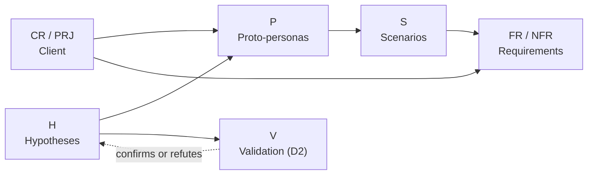

# Boutique FMAT — Offline Point of Sale and Inventory for Mobile Devices

> Project for the **Human-Computer Interaction** course (B.Sc. in Software Engineering, FMAT-UADY).
> **Delivery 1:** project definition, hypothesis-based user modeling and initial requirements.

| | |
|---|---|
| **Author** | Alan Pérez (individual work) |
| **Client** | Course professor (Boutique FMAT-UADY) |
| **Current delivery** | 1 of 3 — due 2026-09-30 |
| **Branch** | [`first-delivery`](https://github.com/Alambrep/boutique-fmat-pos/tree/first-delivery) |
| **Status** | Delivered — tag [`delivery-1`](https://github.com/Alambrep/boutique-fmat-pos/releases/tag/delivery-1) |
| **Design (Figma)** | No design artifacts in delivery 1; the low-fidelity prototype starts in delivery 2 |
| **Video / presentation** | [Delivery 1 video](https://youtu.be/kahF-t9Y5TM) — also listed in [`docs/05-presentation/`](docs/05-presentation/README.md) |

---

## For the evaluator

Where each rubric criterion is covered, with the known gaps of this delivery: [**rubric map**](client/rubric-delivery-1.md).

| Criterion | Main evidence |
|---|---|
| 1 — Definition of the project | [Project definition](docs/01-definition/project-definition.md) |
| 2 — User research process | [Validation plan](docs/02-research/validation-plan.md), [instruments](docs/02-research/instruments/), [desk research results](docs/02-research/results/desk-research.md), [hypotheses](docs/02-research/hypotheses.md), [schedule](docs/00-management/schedule.md), this README |
| 3 — User modeling | [Proto-personas](docs/03-user-modeling/proto-personas.md), [scenarios](docs/03-user-modeling/scenarios.md) |
| 4 — Product requirements | [Functional](docs/04-requirements/functional-requirements.md), [non-functional](docs/04-requirements/non-functional-requirements.md), [traceability matrix](docs/04-requirements/traceability-matrix.md) |
| 5 — Presentation | [Video](docs/05-presentation/README.md) |
| 6 — Collaborative work (individual) | [Contribution metrics](docs/00-management/contribution-metrics.md), [logbook](docs/00-management/logbook/), [task log](docs/00-management/task-log.md), [meeting log](docs/00-management/meetings.md) |

---

## 1. What this project is

A point of sale (POS) and inventory system for the FMAT-UADY Boutique. It must:

- Run on **low-end mobile devices** `[PRJ-01]`.
- **Work offline** and synchronize later `[PRJ-02]`.
- Be simple enough for **a person with limited technology skills** `[PRJ-03]`.
- Manage inventory across **three warehouses** (CDU, Sociales, Matemáticas), with CDU as the main warehouse `[CR-08, CR-09]`.
- Serve **four user profiles** with different permissions (CDU, Central Administration, Social Sciences Campus, Exact Sciences Campus) `[CR-01…CR-04]`.
- Accept **cash, card and Interuady** payments, and send Interuady notes to **accounts receivable** `[CR-12…CR-14]`.

Full details, with identifiers, are in [`client/client-requirements.md`](client/client-requirements.md).

## 2. How to read this repository

Recommended order (follows the product process):

1. [Client requirements](client/client-requirements.md) — starting point and open questions.
2. [Project definition](docs/01-definition/project-definition.md) — social relevance, innovation, feasibility.
3. [Desk research results](docs/02-research/results/desk-research.md) — context evidence DR-1…DR-5 (no user findings yet).
4. [User hypotheses](docs/02-research/hypotheses.md) — numbered assumptions behind the modeling.
5. [Proto-personas](docs/03-user-modeling/proto-personas.md) and [scenarios](docs/03-user-modeling/scenarios.md).
6. [Functional requirements](docs/04-requirements/functional-requirements.md), [non-functional requirements](docs/04-requirements/non-functional-requirements.md) and [traceability matrix](docs/04-requirements/traceability-matrix.md).
7. [Research and validation plan](docs/02-research/validation-plan.md) and [instruments](docs/02-research/instruments/) — what gets validated in delivery 2, and how.
8. [Management](docs/00-management/): [schedule](docs/00-management/schedule.md), [meeting log](docs/00-management/meetings.md), [logbook](docs/00-management/logbook/), [task log](docs/00-management/task-log.md) and [contribution metrics](docs/00-management/contribution-metrics.md).
9. [Presentation video](docs/05-presentation/README.md).
10. [References](docs/references.md) — every external source used, with how to verify it.

## 3. Delivery 1 approach

**Decision:** **no user research was conducted** in this delivery. The work follows a **proto-persona (Lean UX)** approach: the author's assumptions are made explicit, users and requirements are modeled from them, and their validation is planned.

**Reason:** time constraints and individual work. Field research is scheduled for delivery 2 (see the [validation plan](docs/02-research/validation-plan.md)).

**Consequence:** no artifact in this delivery presents findings. Everything that does not come from the client is labeled as a hypothesis.

### Development process

The project follows the four iterative human-centred design activities of ISO 9241-210 `[R34]`, one cycle per delivery:

| Activity | Delivery 1 | Delivery 2 | Delivery 3 |
|---|---|---|---|
| Understand and specify the context of use | Client requirements, desk research, hypotheses | Field research (V-01…V-06) | Refinement |
| Specify user requirements | Proto-personas, scenarios, FR/NFR | Research-based personas; requirements revised | Refinement |
| Produce design solutions | — | Low-fidelity prototype | Iterated prototype |
| Evaluate the design | — | First usability test (V-07) | Usability and technical tests (V-07, V-08) |

### Main results so far (desk research)

Delivery 1 has **no user research findings** yet. These are the results of the [desk research](docs/02-research/results/desk-research.md); each one links to its section:

1. **Market** ([DR-1](docs/02-research/results/desk-research.md#dr-1--existing-solutions)): offline sales and multi-store stock already exist in free tools (Loyverse); the institutional Interuady flow with mandatory data and accounts receivable is not documented in the reviewed products.
2. **Social context** ([DR-2](docs/02-research/results/desk-research.md#dr-2--social-context)): smartphone use is almost universal among cell phone users in Mexico, but only about a quarter of micro establishments use computers or the internet (INEGI).
3. **Legal** ([DR-3](docs/02-research/results/desk-research.md#dr-3--legal-framework-for-personal-data)): new federal (2025) and Yucatán (2025) laws on personal data held by public entities apply to the Interuady data.
4. **Technical** ([DR-4](docs/02-research/results/desk-research.md#dr-4--technical-feasibility)): keyboard-wedge scanners need little integration (the input field must keep focus); Bluetooth printing from web apps is experimental and not available on iOS, which affects the PWA-or-native decision.
5. **Requirements analysis** ([DR-5](docs/02-research/results/desk-research.md#dr-5--requirements-analysis-of-the-clients-document)): 16 open questions for the client, including how 4 profiles map to 3 warehouses, whether each warehouse is also a point of sale, and where the synchronization server would be hosted.

## 4. Evidence conventions

Every statement in the artifacts under `client/` and `docs/01…04` carries one of these labels:

| Label | Meaning | Where it lives |
|---|---|---|
| `CR-xx` | **Client requirement** — stated in the client's written document | `client/client-requirements.md` |
| `PRJ-xx` | **Project requirement** — part of the project brief given by the professor, not in the written document | `client/client-requirements.md` |
| `H-xx` | **Hypothesis** — unvalidated assumption | `docs/02-research/hypotheses.md` |
| `Q-xx` | **Open question** for the client | `client/client-requirements.md` |
| `V-xx` | Planned **validation activity** | `docs/02-research/validation-plan.md` |
| `[Rn]` | **External source**, checked against the original | `docs/references.md` |

Rule: **nothing is presented as a finding** until a `V-xx` activity confirms it; the hypothesis then changes status to *validated* or *refuted* and the evidence is recorded.

## 5. Identifiers and traceability

| Prefix | Artifact |
|---|---|
| `P-xx` | Proto-persona |
| `S-xx` | Scenario |
| `FR-xx` | Functional requirement |
| `NFR-xx` | Non-functional requirement (usability or quality attribute) |
| `T-xx` | Task (GitHub issue) |
| `D1…D5` | Proposed differentiator (project definition §3) |
| `DR-x` | Desk research result |
| `RQ-x` | Research question (validation plan) |
| `DI-xx` | Design implication derived from a scenario |
| `FR-Dx` | Deferred functional requirement (depends on an open question) |

Traceability rule: **every `P`, `S`, `FR` and `NFR` cites at least one `H`, `CR` or `PRJ`.** The views are generated by [`tools/trace.py`](tools/trace.py), which also checks that every client requirement and design implication is covered. The full matrix is in [`traceability-matrix.md`](docs/04-requirements/traceability-matrix.md).



## 6. Repository structure

```
boutique-fmat-pos/
├── README.md
├── .github/
│   └── ISSUE_TEMPLATE/
│       └── task.md                          # template for every task (T-xx)
├── client/
│   ├── client-requirements.md               # CR-xx, PRJ-xx and open questions Q-xx
│   ├── rubric-delivery-1.md
│   └── originals/                           # documents exactly as delivered by the client
├── docs/
│   ├── 00-management/
│   │   ├── schedule.md
│   │   ├── task-log.md                      # tasks, owner, estimated and actual hours
│   │   ├── contribution-metrics.md          # objective individual contribution metric
│   │   ├── meetings.md                      # meetings with the client
│   │   └── logbook/                         # one entry per work session: YYYY-MM-DD.md
│   ├── 01-definition/
│   │   └── project-definition.md
│   ├── 02-research/
│   │   ├── hypotheses.md
│   │   ├── validation-plan.md
│   │   ├── instruments/                     # observation guide, seller and staff interview guides, device and connectivity checklist
│   │   └── results/
│   │       └── desk-research.md             # DR-1…DR-5 (D1); field findings go here in D2
│   ├── 03-user-modeling/
│   │   ├── proto-personas.md
│   │   ├── scenarios.md
│   │   └── img/
│   ├── 04-requirements/
│   │   ├── functional-requirements.md
│   │   ├── non-functional-requirements.md
│   │   └── traceability-matrix.md
│   ├── 05-presentation/
│   │   └── README.md                        # link to the delivery video
│   └── references.md                        # external sources [Rn], verified
├── design/
│   └── README.md                            # links to Figma, sketches and wireframes
├── src/
│   └── README.md                            # reserved for later deliveries
└── tools/
    ├── metrics.py                           # computes the contribution metrics from git and the artifacts
    └── trace.py                             # regenerates the traceability views and checks coverage
```

## 7. Delivery 1 deliverables

| # | Artifact | File | Rubric criterion | Status |
|---|---|---|---|---|
| 1 | Client requirements and open questions | `client/client-requirements.md` | 1, 4 | Done |
| 2 | Project definition | `docs/01-definition/project-definition.md` | 1 | Done |
| 3 | User hypotheses | `docs/02-research/hypotheses.md` | 2, 3 | Done |
| 4 | User profiles and proto-personas (primary and secondary) | `docs/03-user-modeling/proto-personas.md` | 3 | Done |
| 5 | Scenarios | `docs/03-user-modeling/scenarios.md` | 3 | Done |
| 6 | Functional requirements | `docs/04-requirements/functional-requirements.md` | 4 | Done |
| 7 | Non-functional requirements | `docs/04-requirements/non-functional-requirements.md` | 4 | Done |
| 8 | Traceability matrix | `docs/04-requirements/traceability-matrix.md` | 3, 4 | Done |
| 9 | Research and validation plan + instruments | `docs/02-research/validation-plan.md`, `instruments/` | 2 | Done |
| 9b | Desk research results | `docs/02-research/results/desk-research.md` | 1, 2 | Done |
| 10 | Schedule | `docs/00-management/schedule.md` | 2 | Done |
| 11 | Logbook and task log | `docs/00-management/` | 2, 6 | Done (updated each session) |
| 11b | Meeting log | `docs/00-management/meetings.md` | 6 | Done |
| 12 | Individual contribution metrics | `docs/00-management/contribution-metrics.md` | 6 | Done (updated each session) |
| 13 | Presentation video | `docs/05-presentation/` | 5 | Done |

## 8. Workflow and contribution evidence

Although this is an individual project, the process leaves verifiable evidence in the repository:

- **Branches:** `main` holds the approved version of each delivery. Each delivery is developed in its own branch (`first-delivery`, `second-delivery`, `third-delivery`) and closed with a Pull Request to `main` and a tag (`delivery-1`, `delivery-2`, `delivery-3`).
- **Tasks:** every task is an *issue* created from the [`task.md`](.github/ISSUE_TEMPLATE/task.md) template, with a `T-xx` identifier, the `delivery-1` label and the rubric criterion it addresses. All belong to the "Delivery 1" *milestone*.
- **Commits:** [Conventional Commits](https://www.conventionalcommits.org/) format, referencing the task:

  ```
  type(scope): short description (T-xx)
  ```

  | Type | Use | | Scope | Area |
  |---|---|---|---|---|
  | `docs` | artifacts and documentation | | `def` | project definition |
  | `design` | Figma, sketches, images | | `res` | research and hypotheses |
  | `chore` | structure, templates | | `usr` | proto-personas and scenarios |
  | `feat` / `fix` | code (later deliveries) | | `req` | requirements |
  | | | | `mgmt` / `pres` | management / presentation |

  Example: `docs(req): add NFR-01 to NFR-08 by usability attribute (T-07)`

- **Logbook:** one entry per work session in `docs/00-management/logbook/YYYY-MM-DD.md` (what was done, decisions, hours, related tasks and commits).
- **Contribution metric:** computed from the git history and the task log; see [`contribution-metrics.md`](docs/00-management/contribution-metrics.md). Base commands:

  ```bash
  # Commits per day
  git log --date=short --pretty=format:'%ad' | sort | uniq -c
  # Commits per type (docs, design, chore…)
  git log --pretty=format:'%s' | cut -d'(' -f1 | cut -d':' -f1 | sort | uniq -c
  # Commits per task
  git log --pretty=format:'%s' | grep -oE 'T-[0-9]+' | sort | uniq -c
  # Lines added and removed in docs/
  git log --numstat --pretty=format:'' -- docs/ | awk '{a+=$1; d+=$2} END {print "+"a" -"d}'
  ```
- **History rewrite:** on 2026-09-28 the first commits were rewritten once to translate the repository to English, so several commits share the same timestamp (see the [logbook](docs/00-management/logbook/2026-09-28.md)). Later review fixes were also committed in batches at the end of a session. Commit times therefore mark when work was saved, not how long it took; session hours are in the logbook.

## 9. Open questions for the client

The client's document leaves several points undefined (meaning of *CDU* and *C.P.*, how 4 profiles map to 3 warehouses, VAT and invoicing, transfers between warehouses, cancellations, among others). They are numbered `Q-01…Q-16` in [`client/client-requirements.md`](client/client-requirements.md#open-questions-for-the-client). Until they are answered, the artifacts that depend on them rely on an explicit hypothesis.

## 10. Known limitations of this delivery

- Proto-personas and scenarios are based on **hypotheses**, not field data.
- Non-functional requirements have **tentative targets**; they will be adjusted after validation.
- There is no clickable prototype yet.

## 11. Language

Repository content is written in English. Client documents in `client/originals/` are kept in their original language (Spanish); proper names (warehouses, profiles, *Interuady*) are kept in Spanish.

## 12. AI assistance statement

This project uses an AI assistant (**Claude, by Anthropic**) openly, as a working tool. Commits in which the assistant took part include a `Co-Authored-By: Claude` line.

| The AI assistant was used for | The author was responsible for |
|---|---|
| Drafting and structuring documents from the author's instructions | Choosing the approach (Lean UX proto-personas, branch per delivery, English repository, open use of AI) |
| Transcribing, translating and numbering the client's requirements | Providing the facts no document contained (project brief, context of the boutique's point at FMAT, original documents, presentation format, dates) |
| Searching external sources and checking every citation against the original page (see [`references.md`](docs/references.md)) | Setting the rules the work had to follow (hypotheses labeled, no invented data, verified sources only) |
| Preparing and executing git and GitHub operations (commits, issues, milestone) | Requesting reviews of the whole repository and deciding the closing order |
| Proposing hypotheses, questions and design options | Approving the work after a summary of each step, and deciding what to keep |
| Reviewing the repository against the rubric (two reviews, by Claude in separate conversations) and checking each review proposal against the files and sources before applying it | Recording the presentation video |
| Writing the scripts in `tools/` | Conducting the user research and validation in delivery 2 |

Rules followed:

- The AI does not produce findings. Everything not stated by the client is labeled as a hypothesis (`H-xx`) until it is validated with real users.
- The AI does not invent statistics, quotes or sources. A claim that could not be verified is not included.
- Work done by the assistant is not presented as the author's; the author's own contribution is measured in [`contribution-metrics.md`](docs/00-management/contribution-metrics.md#2-author-attributable-metrics).

## 13. Tools

GitHub (repository, *issues*, *milestones*), Figma (design), Markdown + Mermaid (documentation), Claude (AI assistant; see §12).

---

_Academic use — FMAT-UADY, 2026._
