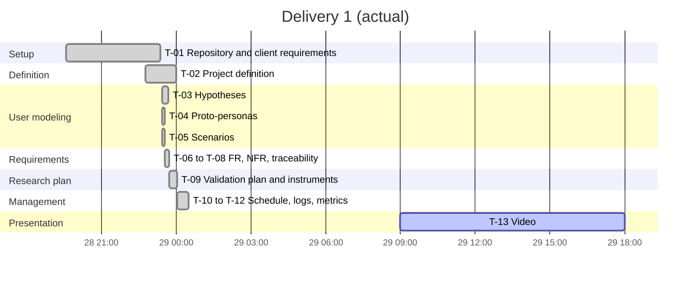

# Schedule

> **Task:** T-10 · **Rubric criterion:** 3 · **Owner of every task:** Alancete (individual project)
>
> Actual dates and times come from the git history and GitHub issues; see the [task log](task-log.md) and [logbook](logbook/).

## 1. Project roadmap

| Delivery | Branch | Focus | Due date | Status |
|---|---|---|---|---|
| 1 | `first-delivery` | Project definition, hypothesis-based user modeling (proto-personas), initial requirements, research plan | 2026-09-29 | In progress |
| 2 | `second-delivery` | User research (V-01…V-06), research-based personas, low-fidelity prototype, first usability test (V-07) | To be announced | Planned |
| 3 | `third-delivery` | Iterated prototype, usability testing, technical tests (V-08) | To be announced | Planned |

## 2. Delivery 1 — activities

| Task | Activity | Artifact | Planned | Actual | Status |
|---|---|---|---|---|---|
| T-01 | Repository structure, README, client requirements | `README.md`, `client/` | 2026-09-28 | 2026-09-28 | Done |
| T-02 | Project definition (relevance, innovation, feasibility) | `docs/01-definition/project-definition.md` | 2026-09-28 | 2026-09-28 → 2026-09-29 (POS comparison) | Done |
| T-03 | User hypotheses | `docs/02-research/hypotheses.md` | 2026-09-28 | 2026-09-28 | Done |
| T-04 | Proto-personas | `docs/03-user-modeling/proto-personas.md` | 2026-09-28 | 2026-09-28 | Done |
| T-05 | Scenarios | `docs/03-user-modeling/scenarios.md` | 2026-09-28 | 2026-09-28 | Done |
| T-06 | Functional requirements | `docs/04-requirements/functional-requirements.md` | 2026-09-28 | 2026-09-28 | Done |
| T-07 | Non-functional requirements | `docs/04-requirements/non-functional-requirements.md` | 2026-09-28 | 2026-09-28 | Done |
| T-08 | Traceability matrix | `docs/04-requirements/traceability-matrix.md` | 2026-09-28 | 2026-09-28 | Done |
| T-09 | Research and validation plan + instruments | `docs/02-research/` | 2026-09-28 | 2026-09-29 | Done |
| T-10 | Schedule | `docs/00-management/schedule.md` | 2026-09-29 | 2026-09-29 | Done |
| T-11 | Logbook and task log | `docs/00-management/` | Every session | Every session | Ongoing |
| T-12 | Individual contribution metrics | `docs/00-management/contribution-metrics.md` | 2026-09-29 | 2026-09-29 | Done (updated at close) |
| T-13 | Presentation video | `docs/05-presentation/` | 2026-09-29 | — | Pending |

## 3. Remaining steps for delivery 1 (2026-09-29)

| # | Step | Task |
|---|---|---|
| 1 | Optional: connectivity check at the FMAT point with the [checklist](../02-research/instruments/device-connectivity-checklist.md) | T-09 (V-05) |
| 2 | Record the video and add it (or its link) to `docs/05-presentation/` | T-13 |
| 3 | Update logbook and contribution metrics with the final session | T-11, T-12 |
| 4 | Open a Pull Request `first-delivery` → `main`, merge it and tag `delivery-1` | T-01 |
| 5 | Submit the repository link | — |

## 4. Timeline

## 5. Delivery 2 — planned activities (dates to be set when announced)

| Week | Activities | Tasks (to be created) |
|---|---|---|
| 1 | Client interview and open questions (V-04); device and connectivity check (V-05); observation (V-01) | T-14…T-16 |
| 2 | Seller interviews (V-02); CDU interview (V-03); records review (V-06) | T-17…T-19 |
| 3 | Analysis; update hypotheses, personas, scenarios and requirements | T-20…T-21 |
| 4 | Low-fidelity prototype in Figma; first usability test (V-07) | T-22…T-23 |
