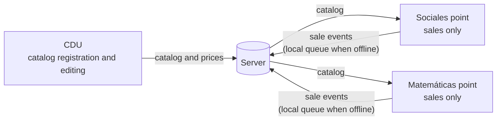

# Project definition

> **Task:** T-02 · **Rubric criterion:** 1 · **Status:** draft for delivery 1
>
> How to read this document: every statement carries its origin.
> `CR-xx` / `PRJ-xx` = client or project requirement ([see](../../client/client-requirements.md)) ·
> `H-xx` = unvalidated hypothesis ([see](../02-research/hypotheses.md)) ·
> `Q-xx` = open question for the client · 🔎 = data point pending verification against a source (see [§6](#6-data-to-verify)).
> **No statement in this document is a research finding.**

---

## 1. Problem

The FMAT-UADY Boutique sells institutional merchandise (clothing and items) across **three warehouses or points of sale** (CDU, Sociales and Matemáticas) `[CR-08]`. It has **four user profiles** with different permissions `[CR-01…CR-04]` and three payment methods, one of them internal to the university (Interuady) `[CR-12]`.

The client needs a system that:

- tracks inventory per warehouse and deducts it automatically with each sale `[CR-08, CR-15]`;
- allows fast sales, showing the product photo and preloaded data `[CR-10, CR-11]`;
- records Interuady payments with their mandatory fields and sends them to accounts receivable `[CR-13, CR-14]`;
- runs on **low-end phones**, **offline**, and for **people with limited technology skills** `[PRJ-01, PRJ-02, PRJ-03]`.

### Assumptions about the current situation

These assumptions guide the design but are **not validated**. They are formalized in [`hypotheses.md`](../02-research/hypotheses.md) and will be validated in delivery 2.

| ID | Hypothesis |
|---|---|
| H-01 | Sellers at the satellite points (Social Sciences and Exact Sciences) are not technical staff and have basic or low digital skills. |
| H-02 | The sales device is a low- or mid-range Android phone, possibly owned by the seller. |
| H-03 | Connectivity at the points of sale is intermittent or unavailable at times. |
| H-04 | Inventory and sales are currently tracked manually or semi-manually (notebook or spreadsheets), and recorded stock differs from actual stock. |
| H-05 | Sales peak at specific times (start of semester, events, graduations), with queues and time pressure. |
| H-06 | The seller works with interruptions and sometimes with only one free hand. |
| H-07 | CDU staff have stronger digital skills and are the ones doing data-entry tasks (product registration, photos, labels). |
| H-08 | Interuady purchases are currently recorded with incomplete or late data, which makes collection harder. |
| H-09 | Buyers are students, staff and visitors, and a typical sale includes few items. |
| H-10 | Card payments are charged on a separate bank terminal; the system only records the payment method (depends on Q-06). |

---

## 2. Social relevance

The rubric asks for arguments and evidence that the issue is a social one. There are three arguments, ordered by strength.

### 2.1 Digital inclusion of people with low technology skills

The client explicitly requires the system to be usable by "someone with limited technology skills", using a hot dog vendor as an example `[PRJ-03]`. This makes the project more than an internal system: it is a design case for **users who are usually left out** of digital management tools.

- If the design works for the boutique's seller `[H-01]`, the same patterns apply to **micro-businesses with limited resources and skills**, operating on modest phones `[H-02]` with unreliable connectivity `[H-03]`.
- 🔎 **Missing evidence and where to find it:** share of micro-businesses in Mexico that do not use digital tools for inventory or sales (INEGI — ENAPROCE, latest edition; Economic Census); smartphone and internet use by state, particularly Yucatán (INEGI — ENDUTIH, latest edition). **Do not write any figure until you have the table and the year.**

### 2.2 Responsible management of a public institution's resources

UADY is a public university. The boutique handles inventory and payments, including internal charges between university units (Interuady) `[CR-12…CR-14]`. Reliable stock records per warehouse `[CR-08, CR-15]` and visible accounts receivable `[CR-14]` support **traceability and accountability** over institutional assets. What makes the problem urgent is the assumption that there are currently inventory discrepancies `[H-04]` and incomplete collections `[H-08]`; this must be validated.

### 2.3 Personal data protection

Interuady payments require recording people's names (the C.P. responsible for the payment and the requester) `[CR-13]`, and those notes are visible to all users `[CR-14]`. A system running on phones, possibly personal ones `[H-02]`, and offline `[PRJ-02]` stores personal data on devices outside institutional control. Designing this correctly is a legal and ethical responsibility, not only a technical one (see §4.2, challenge 4).

---

## 3. Innovation

**Honest position:** the innovation is not inventing a point of sale. It lies in **the combination of constraints** that commercial products generally do not address together, and in **a design approach centered on a user with low digital skills**.

### 3.1 Proposed differentiators

| # | Differentiator | Origin |
|---|---|---|
| D1 | **Institutional Interuady → accounts receivable flow**, with mandatory fields and visibility for all profiles. It is an internal UADY mechanism; no commercial POS is expected to support it out of the box. 🔎 | CR-12…CR-14 |
| D2 | **Image-driven selling**, not text-driven: the seller recognizes the product by its photo and confirms. Text is secondary. | CR-10, PRJ-03, H-01 |
| D3 | **Offline-first with multiple warehouses and a single catalog publisher** (CDU). Satellite warehouses only generate sales, which reduces synchronization conflicts (see §4.2, challenge 1). | PRJ-02, CR-09, CR-03, CR-04 |
| D4 | **Optional low-cost hardware**: barcode scanner and thermal printer as aids, not as prerequisites for selling. | CR-16, CR-17, PRJ-01 |
| D5 | **Two interfaces for two skill levels**: full data entry for CDU `[H-07]` and a minimal sales interface for satellite points `[H-01]`, instead of one interface for everyone. | CR-01…CR-04 |

### 3.2 Comparison with existing solutions

🔎 **To complete before presenting.** Check the **official websites** of 3 or 4 commercial POS products used in Mexico and fill in the table with ✔ / ✘ / "paid add-on". Do not claim a feature you have not seen. Candidates to review: Loyverse, Square, Clip, Shopify POS.

| Criterion | POS A | POS B | POS C | This project |
|---|---|---|---|---|
| Sells offline | | | | Yes `[PRJ-02]` |
| Multiple warehouses with separate stock | | | | Yes `[CR-08]` |
| Internal institutional payment method | | | | Yes `[CR-12, CR-13]` |
| Built-in accounts receivable | | | | Yes `[CR-14]` |
| Runs on low-end phones | | | | Target `[PRJ-01]` |
| Designed for low digital skills | | | | Target `[PRJ-03]` |
| Cost | | | | No license |

---

## 4. Feasibility

### 4.1 Team strengths and weaknesses (individual work)

| Strengths | Weaknesses |
|---|---|
| Direct access to the client (the professor) to resolve questions `[Q-01…Q-12]`. | A single person: design, research, documentation and development compete for the same time. |
| Physical access to the context: the author studies at FMAT and can observe the boutique and its sellers. | No user data in delivery 1; all modeling rests on hypotheses. |
| Software engineering training (requirements, architecture, version control). | No proven prior experience with point-of-sale hardware (scanner and thermal printer). |
| Scope bounded by a client document with concrete fields and rules `[CR-01…CR-18]`. | Open client decisions (VAT, invoicing, transfers) may change the scope `[Q-05, Q-07]`. |

**Overall mitigation:** prioritize the sales flow (what most users use), leave out of the first version whatever depends on open questions, and validate the highest-risk hypotheses first (see the [validation plan](../02-research/validation-plan.md)).

### 4.2 HCI and product challenges

#### Challenge 1 — Offline synchronization across warehouses `[PRJ-02, CR-08, CR-15]`

**Problem.** Two offline points could sell the last unit of the same product, or CDU could change a price while a satellite point is disconnected.

**Why it is manageable.** The client's permissions shrink the problem:

- Only CDU modifies the catalog `[CR-01, CR-09]`: there is **a single writer** for products and prices.
- Social Sciences and Exact Sciences **only charge** `[CR-03, CR-04]`: they generate **sale events** that are appended, never edits to existing records.
- Each sale is deducted from **its own warehouse** `[CR-15]`, so two warehouses never compete for the same stock.

**Remaining risks:** (a) selling out-of-stock items when two devices sell from the **same** warehouse while offline (depends on Q-11); (b) selling at an outdated price.

**HCI challenge.** The seller `[H-01]` should not need to understand what "syncing" means. Status must be communicated in everyday language ("Saved on this phone — it will be sent when there is internet"), alerts shown only when action is required, and a sale must never be blocked by lack of connectivity.

#### Challenge 2 — Performance on low-end devices `[PRJ-01, CR-06, CR-10]`

**Problem.** Selling relies on photos `[CR-10]`, and photos are the heaviest resource in storage, memory and mobile data on a low-end phone `[H-02]`.

**Approach.** Store compressed thumbnails for selling and the full photo only at CDU; load only the local warehouse's catalog, not all three; minimize animations. Measurable targets (startup time, time to complete a sale, maximum storage) will be defined as NFRs in section 4 and adjusted after measuring on a real device. **There are no figures yet; none will be invented.**

**Pending decision:** installable web app (PWA) or native Android app. Depends on Q-12 and on scanner and printer support (challenge 3).

#### Challenge 3 — Barcode scanner and thermal printer `[CR-16, CR-17]`

**Scanner.** Many external scanners (USB or Bluetooth) behave like a keyboard: they "type" the code into the active field. This simplifies integration 🔎. The **phone camera** can serve as a fallback when no scanner is available.

**Printer.** Phones usually connect to thermal printers over Bluetooth, and support for this in web apps varies by browser and operating system 🔎. This may decide between a PWA and a native app.

**Receipt content.** It cannot be finalized until accounting confirms whether VAT must be broken down and how invoicing works `[CR-18, Q-05]`.

**HCI challenge.** If the scanner or printer fails, the sale must continue manually (search by photo; optional or digital receipt) without blocking the seller.

#### Challenge 4 — Data protection in Interuady payments `[CR-13, CR-14]`

**Data involved.** The names of the C.P. responsible for the payment and of the requester are **personal data**. The meaning of "C.P." is still pending (Q-04).

**Design tension.** The client asks for accounts receivable to be visible to **all** users `[CR-14]`, but showing each profile only the data it needs is good data-minimization practice. **Proposal to discuss with the client:** everyone sees each note's number, unit, amount and status; only profiles with query permission (CDU and Central Administration) see the details about the people involved `[CR-01, CR-02]`.

**Data on the phone.** Because of offline mode, notes may remain stored on phones, possibly personal ones `[PRJ-02, H-02]`. This requires per-user sessions, lock on inactivity, local encryption and deletion of data that has already been synchronized.

**Card.** The system **does not capture or store card data**: it only records that the payment was made by card `[H-10, Q-06]`. This keeps card data security obligations out of scope 🔎.

**Legal framework.** UADY is a public body, so the applicable framework is personal data held by **public-sector entities** (*sujetos obligados*), not by private parties 🔎. The current legal text and the institution's privacy notice must be checked before citing any article.

#### Challenge 5 — Simplicity versus data richness `[PRJ-03, CR-08]`

The inventory table has 10 fields `[CR-08]`, which clashes with an interface for people with low digital skills `[PRJ-03, H-01]`. **Approach:** the complexity lives in the CDU interface `[H-07]`. The sales screen shows only photo, name, price and quantity `[CR-10, CR-11]`, and the three Interuady fields appear only when that payment method is chosen `[CR-13]`.

### 4.3 Project risks

| Risk | Likelihood | Impact | Mitigation |
|---|---|---|---|
| Wrong user hypotheses (e.g. H-01, H-02) | Medium | High | Validate them first in delivery 2 through observation and interviews |
| Client questions left unanswered (Q-05, Q-07) | Medium | Medium | Design receipts and transfers as isolated modules; decide based on explicit hypotheses |
| No scanner or printer available for testing | Medium | Medium | Simulate with a keyboard (scanner) and an on-screen or PDF receipt (printer) |
| Not enough time (individual work) | High | High | Minimum scope per delivery; schedule with slack; tracking through issues |
| Unforeseen synchronization conflicts | Low | Medium | Append-only sale event model; tests with disconnected devices |

---

## 5. Proposed scope

| Included in the first working version | Out of the first version (depends on client answers) |
|---|---|
| Sales with photo, quantity and three payment methods `[CR-10…CR-13]` | Invoicing and VAT breakdown `[CR-18, Q-05]` |
| Automatic stock deduction per warehouse `[CR-15]` | Transfers between warehouses `[Q-07]` |
| Product registration with photo and barcode from CDU `[CR-05…CR-07, CR-09]` | Cancellations and returns `[Q-10]` |
| Interuady accounts receivable `[CR-14]` | Bank terminal integration `[Q-06]` |
| Offline operation and synchronization `[PRJ-02]` | Settlement of Interuady notes `[Q-09]` |
| Profiles and permissions `[CR-01…CR-04]` | |

---

## 6. Data to verify

Working list for the author. Each row is a statement that **needs a source before being presented as a fact**. Once verified, record the exact source (title, institution, year, link) and remove the 🔎 from the text.

| # | What to verify | Where to look | Used in |
|---|---|---|---|
| 1 | Use of digital tools (inventory, sales) by micro-businesses in Mexico | INEGI — ENAPROCE; Economic Census | §2.1 |
| 2 | Smartphone and internet use in Yucatán | INEGI — ENDUTIH (latest edition) | §2.1 |
| 3 | Cash versus digital payment use | INEGI/CNBV — ENIF | §2.1 (optional) |
| 4 | Whether commercial POS products sell offline, handle multiple warehouses or custom payment methods | Each product's official website | §3.2 |
| 5 | Whether other UADY units already use a POS or similar system | Ask the client | §3.2 |
| 6 | How barcode scanners connect (keyboard mode) | Manufacturers' spec sheets | §4.2, challenge 3 |
| 7 | Web Bluetooth support by browser | MDN Web Docs; caniuse.com | §4.2, challenge 3 |
| 8 | Obligations when storing card data | PCI Security Standards Council | §4.2, challenge 4 |
| 9 | Current personal data law for public-sector entities (federal and Yucatán) and UADY's privacy notice | DOF; Yucatán State Congress; UADY transparency portal | §4.2, challenge 4 |

---

## Traceability of this document

- **Requirements cited:** CR-01…CR-18, PRJ-01…PRJ-03.
- **Hypotheses introduced:** H-01…H-10 (detailed and prioritized in [`hypotheses.md`](../02-research/hypotheses.md)).
- **Open questions cited:** Q-01, Q-04…Q-07, Q-09…Q-12.
